# Omnara - Mission Control for Your AI Agents 🚀

> ⚠️ **IMPORTANT NOTICE** ⚠️
>
> **This version of Omnara is no longer maintained.** We apologize for the inconvenience. This version was built as a wrapper around the Claude Code CLI, which became unfeasible to maintain with Claude Code's constant updates.
>
> We've migrated to a new voice-first coding agent platform at [https://omnara.com](https://omnara.com) built using the Claude Agent SDK. The new service keeps the features you love - **web and mobile access to your machine** - but we've built our own integrated experience instead of wrapping the Claude Code CLI. This allows us to provide a more reliable and maintainable service.
>
> - **Legacy Web App**: The legacy web dashboard for this deprecated version is at [https://claude.omnara.com](https://claude.omnara.com) and will continue to work until the end of 2025. To use it, upgrade the Python package to version 1.7.0: `pip install omnara==1.7.0`
> - **New Platform**: The new version at [omnara.com](https://omnara.com) is now a bun executable. Install it with: `curl -fsSL https://omnara.com/install/install.sh | bash`
> - **Current Paying Customers**: You can contact us at [contact@omnara.com](mailto:contact@omnara.com) for a refund. We will also apply 2 months of free credits to your account on the new platform at [omnara.com](https://omnara.com) and you will keep your current payment rate **forever**
> - **Mobile App Auto-Updates**: If you have auto-updates enabled, your mobile app may have already updated to v1.5.0 (the new platform). If you need access to the older version (< 1.5.0) for this deprecated platform, please reach out to [contact@omnara.com](mailto:contact@omnara.com) and we can provide access via TestFlight
> - **Building from Source**: The web and mobile apps are now fully open source under Apache 2.0. You can build both the web dashboard (`apps/web/`) and mobile app (`apps/mobile/`) from source if you prefer to self-host or run an older version
> - **Questions**: For any other questions, please contact us at [contact@omnara.com](mailto:contact@omnara.com)

---

<div align="center">

**Your AI workforce, in your pocket.**

[](https://badge.fury.io/py/omnara)
[](https://pepy.tech/project/omnara)
[](https://pypi.org/project/omnara/)
[](https://opensource.org/licenses/Apache-2.0)
[](https://github.com/omnara-ai/omnara)
[](https://github.com/astral-sh/ruff)

</div>


<div align="center">

[📱 **iOS App**](https://apps.apple.com/us/app/omnara-ai-command-center/id6748426727) • [🤖 **Android App**](https://play.google.com/store/apps/details?id=com.omnara.app) • [🌐 **Web Dashboard**](https://claude.omnara.com) • [📖 **Docs**](https://omnara.mintlify.dev/) • [🎥 **Demo**](https://www.loom.com/share/03d30efcf8e44035af03cbfebf840c73?sid=1c209c04-8a4c-4dd6-8c92-735c399886a6) • [⭐ **GitHub**](https://github.com/omnara-ai/omnara)

</div>

---

## 🚀 Quick Start

```bash
# Install Omnara (requires python >= 3.10)
pip install omnara

# Start a Claude Code session that's synced between terminal, web, and mobile
omnara

# Start a Codex CLI session that's synced between terminal, web, and mobile
omnara --agent codex
```

That's it! Create an account when prompted, then return to your terminal to interact with your coding agent. You can now see and interact with your coding agent session from the [web dashboard](https://claude.omnara.com/dashboard) or the [mobile app](https://apps.apple.com/us/app/omnara-ai-command-center/id6748426727).

## 💡 What is Omnara?

Omnara transforms your AI agents (Claude Code, Codex CLI, n8n, and more) from silent workers into communicative teammates. Get real-time visibility into what your agents are doing, and respond to their questions instantly from a single dashboard on web and mobile.


### 🎬 See It In Action


## 📖 How to Use

### 1. Omnara CLI
<details>
<summary>The primary way to use CLI coding agents (Claude Code, Codex CLI) with Omnara</summary>

#### Installation

Install Omnara using your preferred package manager:

```bash
# Using pip
pip install omnara

# Using uv
uv tool install omnara

# Using pipx
pipx install omnara
```

#### Running Omnara

Omnara offers three different modes depending on your workflow:

##### **Standard Mode** - Full Claude Code/Codex CLI Experience
```bash
omnara
```
Starts Claude Code with the standard CLI interface, fully synced across terminal, web dashboard, and mobile app. You interact with Claude Code in your terminal as usual, while everything is mirrored to the Omnara dashboard.

```bash
omnara --agent codex
```
Starts Codex with the standard CLI interface with the same features as noted above

##### **Headless Mode** - Dashboard-Only Interaction
```bash
omnara headless
```
Runs Claude Code in the background without the terminal UI. Perfect for when you want to interact with Claude Code exclusively through the Omnara web dashboard or mobile app.

##### **Server Mode** - Remote Launch Capability
```bash
omnara serve
```
Exposes an endpoint that allows you to launch Claude Code instances remotely from the Omnara dashboard. Ideal for triggering AI agents from your phone or another device.

#### Upgrading

Keep Omnara up-to-date with the latest features:

```bash
# Using pip
pip install omnara --upgrade

# Using uv
uv tool upgrade omnara

# Using pipx
pipx upgrade omnara
```

</details>

### 2. n8n Integration
<details>
<summary>Add human-in-the-loop capabilities to your n8n workflows</summary>

#### What it Does

The Omnara n8n integration provides a specialized "Human in the Loop" node that enables real-time human-AI collaboration within your n8n workflows. Perfect for approval workflows, agent conversations, and guided automation.


#### Installation & Setup

For detailed installation and configuration instructions, see the [n8n-nodes-omnara package](https://www.npmjs.com/package/n8n-nodes-omnara) on npm.

</details>

### 3. GitHub Actions Integration
<details>
<summary>Run Claude Code in GitHub Actions with Omnara monitoring</summary>

#### What it Does

The Omnara GitHub Actions integration allows you to trigger Claude Code to run in your GitHub Actions workflows via repository dispatch events, while monitoring and interacting with it through the Omnara dashboard.

#### Key Features

- **Remote Launch**: Start GitHub Actions from your phone or web dashboard
- **Automatic PR Creation**: Claude creates branches, commits changes, and opens PRs
- **Real-time Monitoring**: Track progress and provide guidance through Omnara

#### Installation & Setup

For complete setup instructions including GitHub workflow configuration, see the [GitHub Actions integration guide](./src/integrations/github/claude-code-action/README.md).

</details>

## 🔧 Integrating your own Agent into Omnara


### Method 1: Manual MCP Configuration

For custom MCP setups, you can configure manually:

```json
{
  "mcpServers": {
    "omnara": {
      "command": "pipx",
      "args": ["run", "--no-cache", "omnara", "mcp", "--api-key", "YOUR_API_KEY"]
    }
  }
}
```

### Method 2: Python SDK
```python
from omnara import OmnaraClient
import uuid

client = OmnaraClient(api_key="your-api-key")
instance_id = str(uuid.uuid4())

# Log progress and check for user feedback
response = client.send_message(
    agent_type="claude-code",
    content="Analyzing codebase structure",
    agent_instance_id=instance_id,
    requires_user_input=False
)

# Ask for user input when needed
answer = client.send_message(
    content="Should I refactor this legacy module?",
    agent_instance_id=instance_id,
    requires_user_input=True
)
```

### Method 3: REST API
```bash
curl -X POST https://agent.omnara.com/api/v1/messages/agent \
  -H "Authorization: Bearer YOUR_API_KEY" \
  -H "Content-Type: application/json" \
  -d '{"content": "Starting deployment process", "agent_type": "claude-code", "requires_user_input": false}'
```

## 🏗️ Architecture Overview

Omnara provides a unified platform for monitoring and controlling your AI agents:

```mermaid
graph TB
    subgraph "Your AI Agents"
        A[🤖 AI Agents<br/>Claude Code, Cursor, etc.]
    end

    subgraph "Omnara Platform"
        API[🌐 API Server]
        DB[(📊 PostgreSQL)]
        NOTIFY[🔔 Notification Service<br/>Push/Email/SMS]
    end

    subgraph "Your Devices"
        M[📱 Mobile App]
        W[💻 Web Dashboard]
    end

    A -->|Send updates| API
    API -->|Store data| DB
    API -->|Trigger notifications| NOTIFY
    NOTIFY -->|Alert users| M
    DB -->|Real-time sync| M
    DB -->|Real-time sync| W
    M -->|User responses| API
    W -->|User responses| API
    API -->|Deliver feedback| A

    style A fill:#e3f2fd,stroke:#1976d2,stroke-width:3px,color:#000
    style API fill:#c8e6c9,stroke:#388e3c,stroke-width:2px,color:#000
    style DB fill:#ffccbc,stroke:#d84315,stroke-width:2px,color:#000
    style NOTIFY fill:#fff59d,stroke:#f57f17,stroke-width:2px,color:#000
    style M fill:#f8bbd0,stroke:#c2185b,stroke-width:3px,color:#000
    style W fill:#f8bbd0,stroke:#c2185b,stroke-width:3px,color:#000
```



### For Developers

<details>
<summary><b>🛠️ Development Setup</b></summary>

**Prerequisites:** Docker, Python 3.10+, Node.js

**Quick Start:**
```bash
git clone https://github.com/omnara-ai/omnara
cd omnara
cp .env.example .env
python infrastructure/scripts/generate_jwt_keys.py
./dev-start.sh  # Starts everything automatically
```

**Stop services:** `./dev-stop.sh`

For detailed setup instructions, manual configuration, and contribution guidelines, see our [Contributing Guide](CONTRIBUTING.md).

</details>

## 🤝 Contributing

We love contributions! Check out our [Contributing Guide](CONTRIBUTING.md) to get started.

### Development Commands
```bash
make lint       # Run code quality checks
make format     # Auto-format code
make test       # Run test suite
./dev-start.sh  # Start development servers
```

## 📊 Pricing

| Plan | Price | Features |
|------|-------|----------|
| **Free** | $0/mo | 10 agents/month, Core features |
| **Pro** | $9/mo | Unlimited agents, Priority support |
| **Enterprise** | [Contact Us](https://cal.com/ishaan-sehgal-8kc22w/omnara-demo) | Teams, SSO, Custom integrations |

## 🆘 Support

- 💬 [GitHub Discussions](https://github.com/omnara-ai/omnara/discussions)
- 🐛 [Report Issues](https://github.com/omnara-ai/omnara/issues)
- 📧 [Email Support](mailto:ishaan@omnara.com)
- 📖 [Documentation](https://omnara.mintlify.dev/)

## 📜 License

Omnara is open source software licensed under the [Apache 2.0 License](LICENSE).

---

<div align="center">

**Built with ❤️ by the Omnara team**

[Website](https://claude.omnara.com) • [Docs](https://omnara.mintlify.dev/) • [Twitter](https://twitter.com/omnaraai) • [LinkedIn](https://linkedin.com/company/omnara)

</div>
