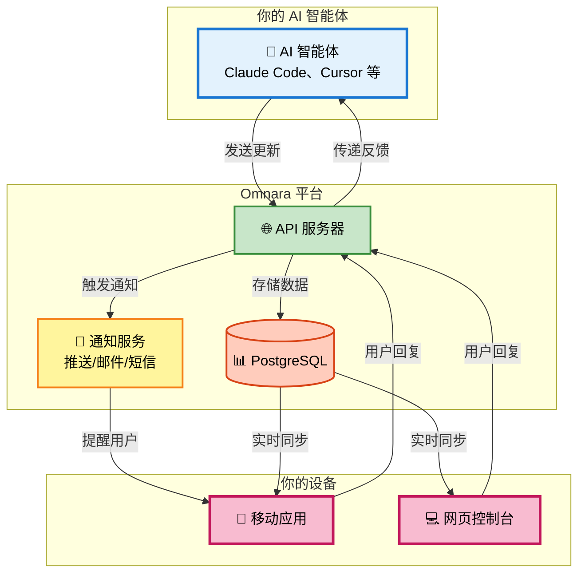

# Omnara - 你的 AI 智能体任务控制中心 🚀

> 🇨🇳 **本仓库是 [omnara-ai/omnara](https://github.com/omnara-ai/omnara) 的非官方中文汉化版**，与 Omnara 官方无关。汉化遵循 Apache 2.0 许可证，完整保留原项目的版权声明与 LICENSE。英文原版请访问[上游仓库](https://github.com/omnara-ai/omnara)。
>
> 🇨🇳 **This is an unofficial Chinese localization of [omnara-ai/omnara](https://github.com/omnara-ai/omnara)**, not affiliated with the Omnara team. Distributed under Apache 2.0 with the original copyright notices preserved.

> ⚠️ **重要通知** ⚠️
>
> **此版本的 Omnara 已停止维护。**给您带来的不便我们深表歉意。此版本是基于 Claude Code CLI 的包装器构建的，由于 Claude Code 持续不断地更新，这种方式已经难以继续维护。
>
> 我们已迁移到全新的语音优先编码智能体平台 [https://omnara.com](https://omnara.com)，新平台基于 Claude Agent SDK 构建。新服务保留了您喜爱的功能——**通过网页和移动端访问您的机器**——但我们构建了自己的一体化体验，而不再包装 Claude Code CLI。这使我们能够提供更可靠、更易维护的服务。
>
> - **旧版网页应用**：此废弃版本的旧版网页控制台位于 [https://claude.omnara.com](https://claude.omnara.com)，将持续运行到 2025 年底。使用前请将 Python 包升级到 1.7.0 版本：`pip install omnara==1.7.0`
> - **新平台**：[omnara.com](https://omnara.com) 上的新版本现在是一个 bun 可执行文件。安装方式：`curl -fsSL https://omnara.com/install/install.sh | bash`
> - **现有付费用户**：您可以通过 [contact@omnara.com](mailto:contact@omnara.com) 联系我们申请退款。我们还会在新平台 [omnara.com](https://omnara.com) 上为您的账户提供 2 个月的免费额度，并且您将**永久**保留当前的付费价格
> - **移动应用自动更新**：如果您开启了自动更新，移动应用可能已经更新到 v1.5.0（新平台版本）。如果您需要访问适用于此废弃平台的旧版本（< 1.5.0），请联系 [contact@omnara.com](mailto:contact@omnara.com)，我们可以通过 TestFlight 提供访问
> - **从源码构建**：网页和移动应用现已在 Apache 2.0 许可证下完全开源。如果您希望自托管或运行旧版本，可以从源码构建网页控制台（`apps/web/`）和移动应用（`apps/mobile/`）
> - **其他问题**：如有任何其他疑问，请联系 [contact@omnara.com](mailto:contact@omnara.com)

---

<div align="center">

**你的 AI 工作团队，尽在掌中。**

[](https://badge.fury.io/py/omnara)
[](https://pepy.tech/project/omnara)
[](https://pypi.org/project/omnara/)
[](https://opensource.org/licenses/Apache-2.0)
[](https://github.com/omnara-ai/omnara)
[](https://github.com/astral-sh/ruff)

</div>


<div align="center">

[📱 **iOS 应用**](https://apps.apple.com/us/app/omnara-ai-command-center/id6748426727) • [🤖 **Android 应用**](https://play.google.com/store/apps/details?id=com.omnara.app) • [🌐 **网页控制台**](https://claude.omnara.com) • [📖 **文档**](https://omnara.mintlify.dev/) • [🎥 **演示视频**](https://www.loom.com/share/03d30efcf8e44035af03cbfebf840c73?sid=1c209c04-8a4c-4dd6-8c92-735c399886a6) • [⭐ **GitHub**](https://github.com/omnara-ai/omnara)

</div>

---

## 🚀 快速开始

```bash
# 安装 Omnara（需要 python >= 3.10）
pip install omnara

# 启动一个在终端、网页和移动端之间同步的 Claude Code 会话
omnara

# 启动一个在终端、网页和移动端之间同步的 Codex CLI 会话
omnara --agent codex
```

就这么简单！按提示创建账号，然后回到终端与你的编码智能体交互。现在你可以通过[网页控制台](https://claude.omnara.com/dashboard)或[移动应用](https://apps.apple.com/us/app/omnara-ai-command-center/id6748426727)查看并操作你的编码智能体会话。

## 💡 Omnara 是什么？

Omnara 把你的 AI 智能体（Claude Code、Codex CLI、n8n 等）从沉默的工作者变成善于沟通的队友。通过网页和移动端的统一控制台，实时了解智能体正在做什么，并即时回应它们的提问。


### 🎬 实际效果


## 📖 使用方法

### 1. Omnara CLI
<details>
<summary>在 Omnara 中使用 CLI 编码智能体（Claude Code、Codex CLI）的主要方式</summary>

#### 安装

使用你喜欢的包管理器安装 Omnara：

```bash
# 使用 pip
pip install omnara

# 使用 uv
uv tool install omnara

# 使用 pipx
pipx install omnara
```

#### 运行 Omnara

Omnara 提供三种模式，适配不同的工作流：

##### **标准模式** - 完整的 Claude Code/Codex CLI 体验
```bash
omnara
```
以标准 CLI 界面启动 Claude Code，并在终端、网页控制台和移动应用之间完全同步。你照常在终端中与 Claude Code 交互，所有内容都会同步镜像到 Omnara 控制台。

```bash
omnara --agent codex
```
以标准 CLI 界面启动 Codex，功能同上

##### **无头模式（Headless）** - 仅通过控制台交互
```bash
omnara headless
```
在后台运行 Claude Code，没有终端 UI。适合只想通过 Omnara 网页控制台或移动应用与 Claude Code 交互的场景。

##### **服务器模式（Serve）** - 远程启动能力
```bash
omnara serve
```
暴露一个端点，允许你从 Omnara 控制台远程启动 Claude Code 实例。适合从手机或其他设备触发 AI 智能体。

#### 升级

保持 Omnara 更新以获得最新功能：

```bash
# 使用 pip
pip install omnara --upgrade

# 使用 uv
uv tool upgrade omnara

# 使用 pipx
pipx upgrade omnara
```

</details>

### 2. n8n 集成
<details>
<summary>为你的 n8n 工作流添加"人在回路"（human-in-the-loop）能力</summary>

#### 功能说明

Omnara 的 n8n 集成提供了一个专门的"Human in the Loop"节点，可以在 n8n 工作流中实现实时的人机协作。非常适合审批流程、智能体对话和引导式自动化。


#### 安装与配置

详细的安装和配置说明，请参阅 npm 上的 [n8n-nodes-omnara 包](https://www.npmjs.com/package/n8n-nodes-omnara)。

</details>

### 3. GitHub Actions 集成
<details>
<summary>在 GitHub Actions 中运行 Claude Code，并通过 Omnara 监控</summary>

#### 功能说明

Omnara 的 GitHub Actions 集成允许你通过 repository dispatch 事件触发 Claude Code 在 GitHub Actions 工作流中运行，同时通过 Omnara 控制台进行监控和交互。

#### 核心特性

- **远程启动**：从手机或网页控制台启动 GitHub Actions
- **自动创建 PR**：Claude 自动创建分支、提交更改并发起 PR
- **实时监控**：通过 Omnara 跟踪进度并提供指导

#### 安装与配置

完整的配置说明（包括 GitHub 工作流配置），请参阅 [GitHub Actions 集成指南](./src/integrations/github/claude-code-action/README.md)。

</details>

## 🔧 将你自己的智能体接入 Omnara


### 方式一：手动配置 MCP

对于自定义 MCP 环境，可以手动配置：

```json
{
  "mcpServers": {
    "omnara": {
      "command": "pipx",
      "args": ["run", "--no-cache", "omnara", "mcp", "--api-key", "YOUR_API_KEY"]
    }
  }
}
```

### 方式二：Python SDK
```python
from omnara import OmnaraClient
import uuid

client = OmnaraClient(api_key="your-api-key")
instance_id = str(uuid.uuid4())

# 记录进度并检查用户反馈
response = client.send_message(
    agent_type="claude-code",
    content="Analyzing codebase structure",
    agent_instance_id=instance_id,
    requires_user_input=False
)

# 需要时向用户提问
answer = client.send_message(
    content="Should I refactor this legacy module?",
    agent_instance_id=instance_id,
    requires_user_input=True
)
```

### 方式三：REST API
```bash
curl -X POST https://agent.omnara.com/api/v1/messages/agent \
  -H "Authorization: Bearer YOUR_API_KEY" \
  -H "Content-Type: application/json" \
  -d '{"content": "Starting deployment process", "agent_type": "claude-code", "requires_user_input": false}'
```

## 🏗️ 架构总览

Omnara 提供了一个统一的平台来监控和控制你的 AI 智能体：



### 开发者指南

<details>
<summary><b>🛠️ 开发环境搭建</b></summary>

**前置要求：** Docker、Python 3.10+、Node.js

**快速开始：**
```bash
git clone https://github.com/omnara-ai/omnara
cd omnara
cp .env.example .env
python infrastructure/scripts/generate_jwt_keys.py
./dev-start.sh  # 自动启动所有服务
```

**停止服务：** `./dev-stop.sh`

详细的搭建说明、手动配置和贡献指南，请参阅[贡献指南](CONTRIBUTING.md)。

</details>

## 🤝 参与贡献

我们欢迎任何贡献！请查看[贡献指南](CONTRIBUTING.md)开始参与。

### 开发命令
```bash
make lint       # 运行代码质量检查
make format     # 自动格式化代码
make test       # 运行测试套件
./dev-start.sh  # 启动开发服务器
```

## 📊 价格

| 方案 | 价格 | 功能 |
|------|-------|----------|
| **免费版** | $0/月 | 每月 10 个智能体，核心功能 |
| **专业版** | $9/月 | 无限智能体，优先支持 |
| **企业版** | [联系我们](https://cal.com/ishaan-sehgal-8kc22w/omnara-demo) | 团队协作、SSO、定制集成 |

## 🆘 获取帮助

- 💬 [GitHub 讨论区](https://github.com/omnara-ai/omnara/discussions)
- 🐛 [报告问题](https://github.com/omnara-ai/omnara/issues)
- 📧 [邮件支持](mailto:ishaan@omnara.com)
- 📖 [官方文档](https://omnara.mintlify.dev/)

## 📜 许可证

Omnara 是基于 [Apache 2.0 许可证](LICENSE)的开源软件。

---

<div align="center">

**由 Omnara 团队用 ❤️ 打造**

[官网](https://claude.omnara.com) • [文档](https://omnara.mintlify.dev/) • [Twitter](https://twitter.com/omnaraai) • [LinkedIn](https://linkedin.com/company/omnara)

</div>
