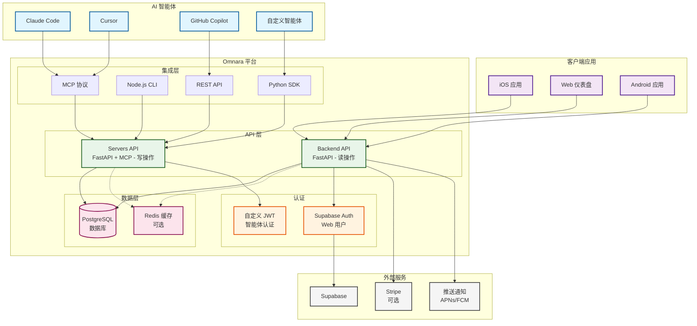
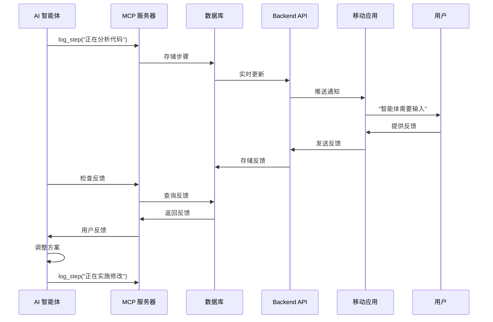
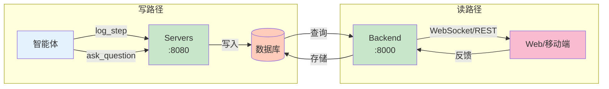

# Omnara 架构图

```mermaid
graph TB
    subgraph "AI 智能体"
        A1[Claude Code]
        A2[Cursor]
        A3[GitHub Copilot]
        A4["自定义智能体"]
    end

    subgraph "客户端应用"
        C1["iOS 应用"]
        C2["Web 仪表盘"]
        C3["Android 应用"]
    end

    subgraph "Omnara 平台"
        subgraph "API 层"
            API1["Backend API<br/>FastAPI - 读操作"]
            API2["Servers API<br/>FastAPI + MCP - 写操作"]
        end

        subgraph "认证"
            AUTH1["Supabase Auth<br/>Web 用户"]
            AUTH2["自定义 JWT<br/>智能体认证"]
        end

        subgraph "数据层"
            DB[("PostgreSQL<br/>数据库")]
            CACHE["Redis 缓存<br/>可选"]
        end

        subgraph "集成层"
            SDK[Python SDK]
            CLI[Node.js CLI]
            MCP["MCP 协议"]
            REST[REST API]
        end
    end

    subgraph "外部服务"
        SUP[Supabase]
        STRIPE["Stripe<br/>可选"]
        PUSH["推送通知<br/>APNs/FCM"]
    end

    %% 智能体连接
    A1 --> MCP
    A2 --> MCP
    A3 --> REST
    A4 --> SDK

    %% 集成层到 Servers
    MCP --> API2
    REST --> API2
    SDK --> API2
    CLI --> API2

    %% 客户端连接
    C1 --> API1
    C2 --> API1
    C3 --> API1

    %% API 到数据库
    API1 --> DB
    API2 --> DB
    API1 -.-> CACHE
    API2 -.-> CACHE

    %% 认证流程
    API1 --> AUTH1
    API2 --> AUTH2
    AUTH1 --> SUP

    %% 外部服务
    API1 --> STRIPE
    API1 --> PUSH

    %% 样式
    classDef agents fill:#e1f5fe,stroke:#01579b,stroke-width:2px
    classDef clients fill:#f3e5f5,stroke:#4a148c,stroke-width:2px
    classDef api fill:#e8f5e9,stroke:#1b5e20,stroke-width:2px
    classDef auth fill:#fff3e0,stroke:#e65100,stroke-width:2px
    classDef data fill:#fce4ec,stroke:#880e4f,stroke-width:2px
    classDef external fill:#f5f5f5,stroke:#424242,stroke-width:2px

    class A1,A2,A3,A4 agents
    class C1,C2,C3 clients
    class API1,API2 api
    class AUTH1,AUTH2 auth
    class DB,CACHE data
    class SUP,STRIPE,PUSH external
```

## 数据流图

```mermaid
sequenceDiagram
    participant Agent as AI 智能体
    participant MCP as MCP 服务器
    participant DB as 数据库
    participant API as Backend API
    participant App as 移动应用
    participant User as 用户

    Agent->>MCP: log_step("正在分析代码")
    MCP->>DB: 存储步骤
    DB->>API: 实时更新
    API->>App: 推送通知
    App->>User: "智能体需要输入"
    
    User->>App: 提供反馈
    App->>API: 发送反馈
    API->>DB: 存储反馈
    
    Agent->>MCP: 检查反馈
    MCP->>DB: 查询反馈
    DB->>MCP: 返回反馈
    MCP->>Agent: 用户反馈
    
    Agent->>Agent: 调整方案
    Agent->>MCP: log_step("正在实施修改")
```

## 组件交互图

```mermaid
graph LR
    subgraph "写路径"
        A["智能体"] -->|log_step| S["Servers<br/>:8080"]
        A -->|ask_question| S
        S -->|"写入"| D[("数据库")]
    end

    subgraph "读路径"
        D -->|"查询"| B["Backend<br/>:8000"]
        B -->|WebSocket/REST| W["Web/移动端"]
        W -->|"反馈"| B
        B -->|"存储"| D
    end

    style A fill:#e3f2fd
    style S fill:#c8e6c9
    style D fill:#ffccbc
    style B fill:#c8e6c9
    style W fill:#f8bbd0
```
